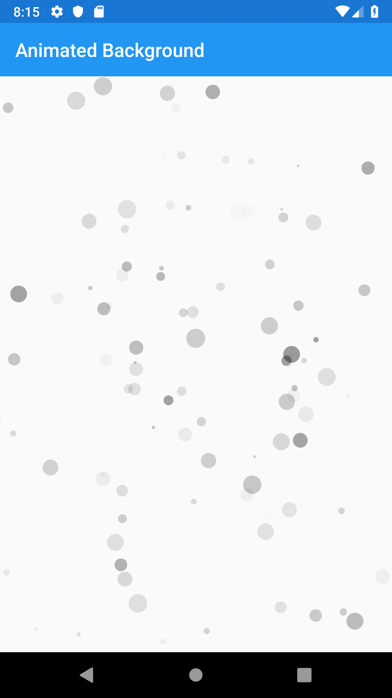
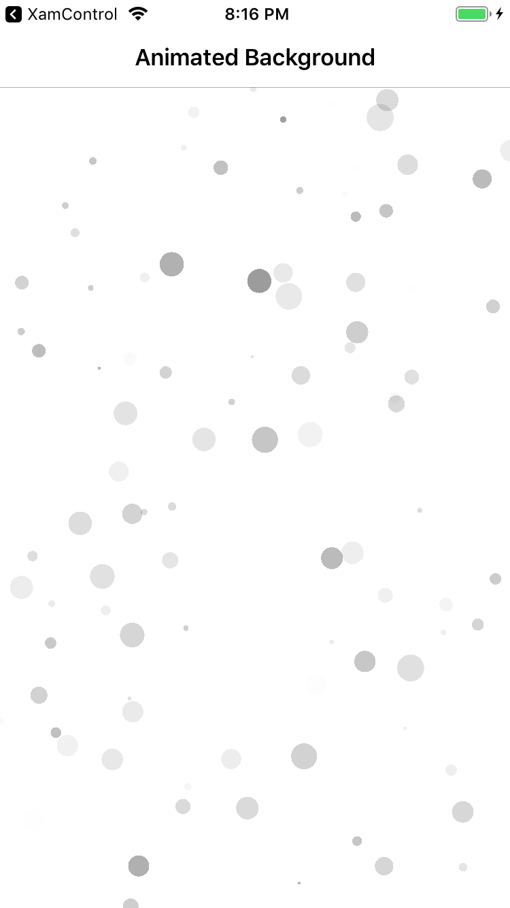
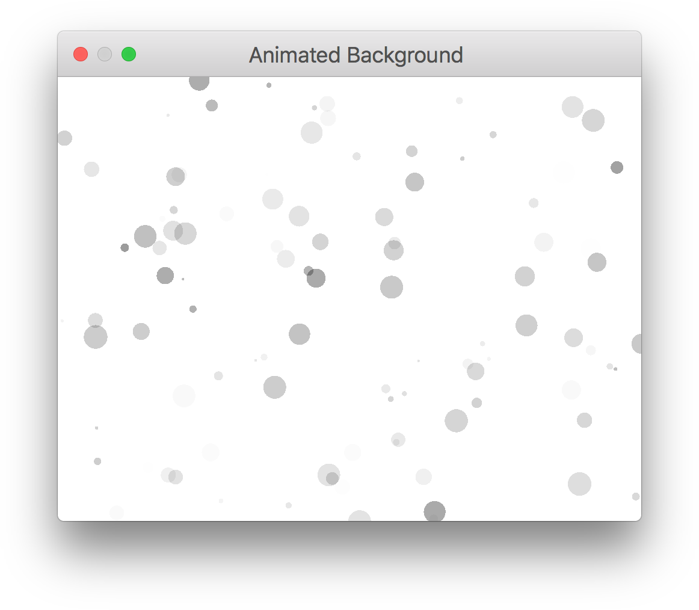
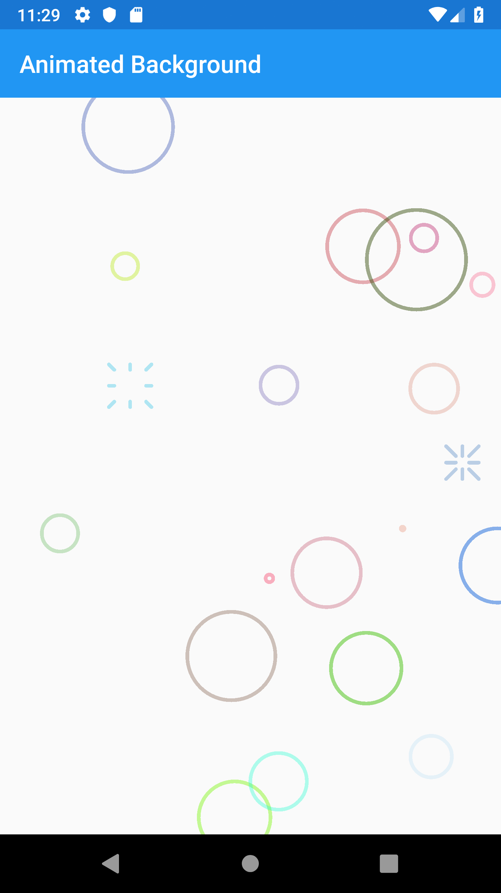

# SkiaSharp Animated Backgrounds

A .NET implementation of https://github.com/AndreBaltazar8/flutter_animated_background

I am not biased 😜 but ovbiously Xamarin and .NET requires much less code - and none of that weird UI strings mid-code.

Not sure where this is going, but seems to work just fine.

And, some screenshots... _of course, there are a few more platforms that I still need to add to the repo and include screenshots for._

| Android | iOS | UWP | Tizen |
| :-: | :-: | :-: | :-: |
|  |  |  |  |
| **macOS** | **WPF** | **GTK#** | |
|  |  |  | |

| Spot (solid) | Bubble |
| :-: | :-: | :-: | :-: |
|  |  |